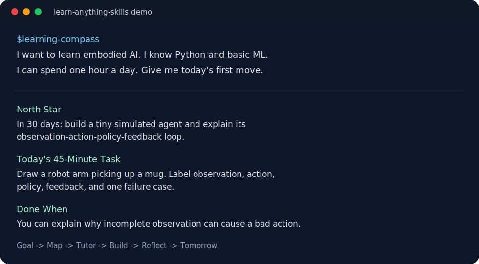

# Learn Anything Skills

[](https://github.com/aoli0919/learn-anything-skills/actions/workflows/validate.yml)


A beginner-first agent skill pack that turns "I want to learn X" into a 30-day path, tutor loop, projects, and learning memory.



## You Bring

- a topic you want to learn
- your current background
- your time budget
- what confused you last time

## The Skills Return

- a 30-day learning path
- today's first task
- beginner concept maps
- active check questions
- small project cards
- paper-to-practice notes
- reflection memory for tomorrow

## Mini Demo

Input:

```text
$learning-compass I want to learn embodied AI.
I know Python and basic ML. I can spend one hour a day.
```

Output:

```text
North Star:
In 30 days, build a tiny simulated agent and explain its perception-action loop.

Today:
Draw a robot arm picking up a mug. Label observation, action, policy,
feedback, and one failure case.

Done when:
You can explain why incomplete observation can cause a bad action.

Reflection:
Log what stayed fuzzy. If state vs observation is still unclear tomorrow,
slow down and use $socratic-tutor before starting a project.
```

## Start Today: 45 Minutes

Copy this:

```text
$learning-compass I want to learn embodied AI.
My background: basic Python and a little machine learning.
Time budget: 45 minutes a day.
Give me today's first task, completion standard, check question, and reflection prompt.
```

Your first artifact should be small: one diagram, one concept card, one toy script, or one learning log.

## Why Star This

Star this if you want:

- AI learning help that produces artifacts, not just answers
- reusable learning loops for hard technical fields
- beginner-friendly domain packs, starting with embodied AI
- skills you can install, validate, remix, and contribute to

This repo ships skills, templates, examples, validation, install scripts, and domain defaults. It is meant to be a usable learning system, not only a prompt collection.

## Why This Exists

Most beginners do not fail because they are lazy. They fail because the first week of a new field is noisy:

- too many resources
- too many unexplained words
- no sense of what matters first
- no feedback after reading
- no small project to make the knowledge stick
- no memory of what they tried last time

Learn Anything Skills turns that mess into a repeatable loop:

```text
Goal -> Map -> Learn -> Test -> Build -> Reflect -> Next Step
```

The point is not to make learning look impressive. The point is to make the next action obvious.

## Quick Start

Clone the repository:

```bash
git clone https://github.com/aoli0919/learn-anything-skills.git
cd learn-anything-skills
```

Install the skills into your Codex skills folder:

```bash
python3 scripts/install.py
```

Check that every skill is valid:

```bash
python3 scripts/validate_skills.py
```

Read the usage guide:

- [Usage Guide](docs/USAGE.md)
- [Embodied AI Domain Pack](domains/embodied-ai.md)
- [Project Pitch](docs/PITCH.md)
- [Launch Kit](docs/LAUNCH.md)

Then ask your agent something like:

```text
I am new to embodied AI. I know basic Python and a little machine learning.
Use the learning system to give me a 30-day plan and today's first task.
```

## The 14 Skills

### Core Learning Loop

#### 1. Learning Compass

Use this when your goal is messy:

```text
I want to learn embodied AI, but I do not know where to start.
```

It produces a learning brief, prerequisite audit, 30-day loop, first week plan, and one concrete task for today.

#### 2. Field Primer

Use this when a field feels like a wall of words.

It builds a beginner map with:

- core concepts
- prerequisite ladders
- vocabulary
- real-world examples
- common beginner traps
- what to ignore for now

#### 3. Socratic Tutor

Use this when you want to learn actively instead of passively reading.

It teaches one idea at a time, asks short questions, catches fuzzy understanding, and adapts the next explanation.

#### 4. Paper to Practice

Use this when you have a paper, blog post, lecture, or GitHub repo and want to understand what it means in practice.

It extracts:

- the problem
- the method
- the assumptions
- the minimal implementation idea
- what a beginner should reproduce
- what to read next

#### 5. Project Lab

Use this when you need a small build.

It creates 2-hour, 1-day, and 1-week projects that turn vague knowledge into visible progress.

#### 6. Reflection Memory

Use this at the end of a session.

It writes a learning log, captures open questions, schedules review, and updates tomorrow's task.

### Hot Skill Extensions

These eight skills were added after reviewing popular skill patterns: concise mode, human-centered outputs, source curation, book/course conversion, codebase-to-course workflows, graph-style knowledge maps, diagnosis loops, and validation through tests.

#### 7. Trend Radar

Use this for fast-moving fields. It turns recent papers, launches, debates, and news into a weekly learning radar with hype to ignore and one action to take.

#### 8. Source Scout

Use this when you have too many tabs. It ranks 3-5 trustworthy resources and tells you exactly what to use, skip, and do first.

#### 9. Book to Skill

Use this when a book, course, PDF, or long guide should become a reusable study system with chapter maps, cards, and a first session.

#### 10. Codebase Apprentice

Use this to turn a GitHub repo or local codebase into a guided course with entry points, reading path, exercises, and first file to inspect.

#### 11. Knowledge Graph

Use this when concepts feel disconnected. It builds a small node-edge graph, weak nodes, review cards, and the next concept edge to study.

#### 12. Stuck Debugger

Use this when learning stalls. It diagnoses the blocker, downgrades the task, and gives a 30-minute recovery plan.

#### 13. Exam Simulator

Use this to test understanding with recall, application, transfer, answer keys, rubrics, weak spots, and review tasks.

#### 14. Token Frugal Mentor

Use this when you want low-token guidance: one task, one artifact, one check question, one stop rule, and one log sentence.

## Example: Embodied AI

See [examples/embodied-ai-30-day-plan.md](examples/embodied-ai-30-day-plan.md).
For reusable domain defaults, see [domains/embodied-ai.md](domains/embodied-ai.md).

A beginner does not need to start by reading every robotics paper. A better first month is:

- understand the perception-action loop
- learn what policies, observations, actions, rewards, simulation, and embodiment mean
- reproduce one toy environment
- read one paper slowly
- build one tiny agent
- keep a daily log of what was confusing

More examples:

- [AI paper reading loop](examples/ai-paper-reading.md)
- [Investing thesis learning loop](examples/investing-thesis-log.md)
- [Hot skill extensions gallery](examples/hot-skill-extensions-gallery.md)
- [Hot skill design notes](docs/HOT_SKILL_NOTES.md)

## Installation Details

By default, `scripts/install.py` copies every folder under `skills/` into:

```text
~/.codex/skills/
```

You can override the target:

```bash
python3 scripts/install.py --target /path/to/skills
```

Dry run:

```bash
python3 scripts/install.py --dry-run
```

## Repository Structure

```text
learn-anything-skills/
  skills/
    learning-compass/
    field-primer/
    socratic-tutor/
    paper-to-practice/
    project-lab/
    reflection-memory/
  examples/
  templates/
  scripts/
```

## Design Principles

- Start from the learner's current state, not an ideal syllabus.
- Use concrete examples before abstract definitions.
- Prefer one useful next action over a huge resource list.
- Make confusion visible instead of treating it as failure.
- Turn reading into cards, cards into checks, checks into projects.
- Keep a learning memory so every session compounds.

## Who This Is For

This project is for:

- beginners entering a technical field
- students who read a lot but build little
- researchers crossing into a new domain
- self-learners who want an AI tutor with structure
- people who need a daily feedback loop, not another bookmark folder

## Not A Promise

This does not magically make hard fields easy. It makes the next learning move smaller, clearer, and less lonely.

## Contributing

Contributions are welcome. Good contributions usually add:

- a better beginner path for a specific field
- a clearer example
- a stricter validation rule
- a project template
- a learning log format that helps people keep going

See [CONTRIBUTING.md](CONTRIBUTING.md).
