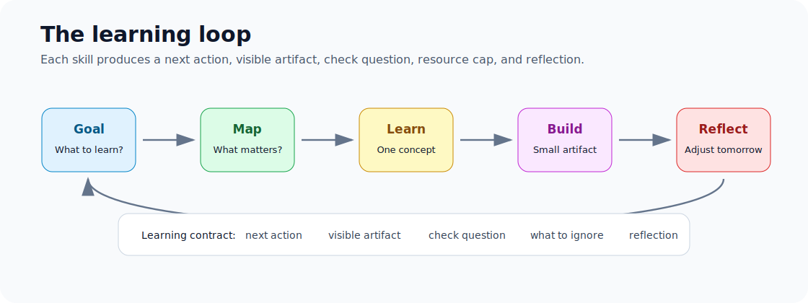
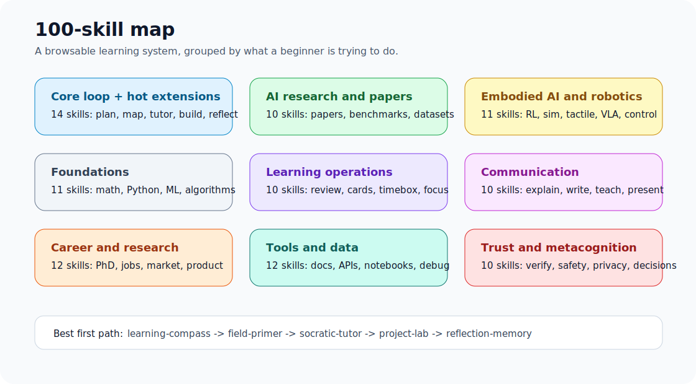

# Learn Anything Skills

一套给初学者用的开源自我学习系统 skills。现在包含 100 个 skill。

它不是“给你一堆资料链接”，而是帮你把一个陌生领域拆成可以每天推进的学习循环：

```text
目标 -> 地图 -> 学习 -> 检查 -> 项目 -> 复盘 -> 下一步
```

比如你想学具身智能，但只知道 Python 和一点机器学习。系统不会直接丢给你几十篇论文，而是先问清楚你现在在哪，然后给你一个 30 天路径、今天能做的一件事、下一次怎么复盘。

## 总览图





## 包含哪些 skills

前 14 个是主循环和热点扩展：

1. **Learning Compass**：把模糊目标变成 30 天学习路线。
2. **Field Primer**：把陌生领域讲成初学者能看懂的地图。
3. **Socratic Tutor**：一问一答，检查你是不是真的懂。
4. **Paper to Practice**：把论文、视频、教程变成可操作的学习卡。
5. **Project Lab**：把知识变成 2 小时、1 天、1 周的小项目。
6. **Reflection Memory**：记录复盘，让学习不断累积。
7. **Trend Radar**：把热点、论文、发布、争议变成每周学习雷达。
8. **Source Scout**：帮初学者从一堆资料里只选 3-5 个真正该看的。
9. **Book to Skill**：把书、课程、PDF、长教程变成可复用学习 skill。
10. **Codebase Apprentice**：把 GitHub 仓库或代码库变成入门课程。
11. **Knowledge Graph**：把零散概念连成小型知识图谱。
12. **Stuck Debugger**：诊断为什么卡住，并降级成 30 分钟恢复任务。
13. **Exam Simulator**：用测试、答案、rubric 找出薄弱点。
14. **Token Frugal Mentor**：省 token、少废话，只给下一步、检查题和停止规则。

完整版本已经扩展到 100 个 skill，覆盖 AI 论文、具身智能、数学基础、学习习惯、写作表达、科研职业、工具数据、可信度检查和元认知。

完整索引看这里：[100 Skill Index](docs/SKILL_INDEX.md)

最推荐的第一条路径：

```text
$learning-compass -> $field-primer -> $socratic-tutor -> $project-lab -> $reflection-memory
```

如果卡住，用 `$stuck-debugger`。如果想追热点，用 `$trend-radar`。如果想知道自己到底会不会，用 `$exam-simulator`。

## 适合谁

- 想入门具身智能、机器人、AI 论文、神经科学、投资等领域的人
- 看了很多资料但不知道今天该干什么的人
- 学一段时间就重启、没有学习记忆的人
- 希望 AI 不只是聊天，而是真的带自己往前走的人

## 安装

```bash
git clone https://github.com/aoli0919/learn-anything-skills.git
cd learn-anything-skills
python3 scripts/install.py
```

校验：

```bash
python3 scripts/validate_skills.py
```

继续看：

- [使用手册](docs/USAGE.md)
- [具身智能领域包](domains/embodied-ai.md)
- [项目推广文案](docs/PITCH.md)
- [发布传播包](docs/LAUNCH.md)
- [100 个 Skills 索引](docs/SKILL_INDEX.md)
- [100 Skills 发布文案](docs/100_SKILLS_LAUNCH.md)

## 示例输入

```text
我想学具身智能。我会一点 Python 和机器学习，但没学过机器人。
请用 self-learning system 给我 30 天路线，并告诉我今天第一件事做什么。
```

## 这套系统的核心

初学者真正需要的不是更多信息，而是更好的顺序、更小的任务、更及时的反馈。

这套 skills 的目标就是让一个陌生领域从“我好像应该学”变成“我今天知道该做什么”。
